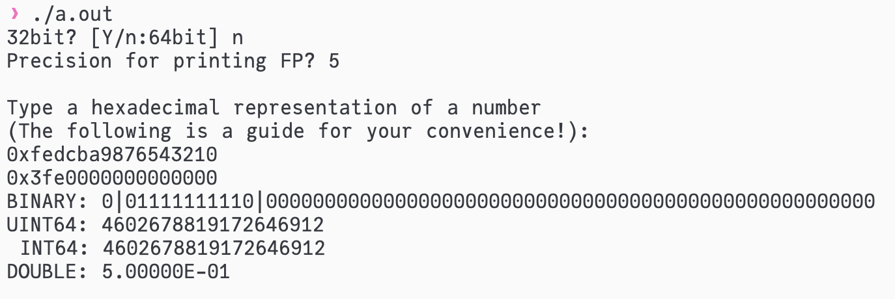

# Floating Fun!
Assumes little-endian.
The screenshot speaks for itself:


## Some fun
```c
#include <stdio.h>

float f = 0.1f;
double a = 0.1;
double b = 0.1f;

int main(void)
{
    printf("%.15lf\n", a);
    printf("%.15lf\n", b);
}
```
prints
```
0.100000000000000
0.100000001490116
```
Why the trailing `149...`?

If we 'cheat' with [Compiler Explorer's help](https://godbolt.org/z/1Ms7xafvb), we have
```asm
f:
        .long   1036831949
a:
        .long   -1717986918
        .long   1069128089
b:
        .long   -1610612736
        .long   1069128089
```

Indeed, we get the following with Floating Fun:
```
32bit? [Y/n:64bit] 
Precision for printing FP? 15

Type a hexadecimal representation of a number
(The following is a guide for your convenience!):
0x76543210
0x3dcccccd
BINARY: 0|01111011|10011001100110011001101
UINT32: 1036831949
 INT32: 1036831949
 FLOAT: 1.000000014901161E-01
```

We can do the conversion from `float` to `double` with pen and pencil.
`01111011` = 123, so the exponent in `float` is 123 - 127 (the bias) = -4.
Back to the world of `double`, e - 1023 (the bias) = -4, hence e = 1019 = `1111111011`.
Padding one `0` on the left makes it 11-digit, and pad another `0` as a sign-bit and convert it to hexadecimal yields `3fb`.
Pad `0`s to the right of the `float`'s mantissa to make it 52 digits and tell it to Floating Fun:
```
32bit? [Y/n:64bit] n
Precision for printing FP? 15

Type a hexadecimal representation of a number
(The following is a guide for your convenience!):
0xfedcba9876543210
0x3fb99999a0000000
BINARY: 0|01111111011|1001100110011001100110100000000000000000000000000000
UINT64: 4591870180174331904
 INT64: 4591870180174331904
DOUBLE: 1.000000014901161E-01
```

The (maybe not-so-)mysterious `-1610612736` of `b` from the Compiler Explorer is from the trailing `a0000000` part!
```
32bit? [Y/n:64bit] 
Precision for printing FP? 0

Type a hexadecimal representation of a number
(The following is a guide for your convenience!):
0x76543210
0xa0000000
BINARY: 1|01000000|00000000000000000000000
UINT32: 2684354560
 INT32: -1610612736
 FLOAT: -1E-19
```
